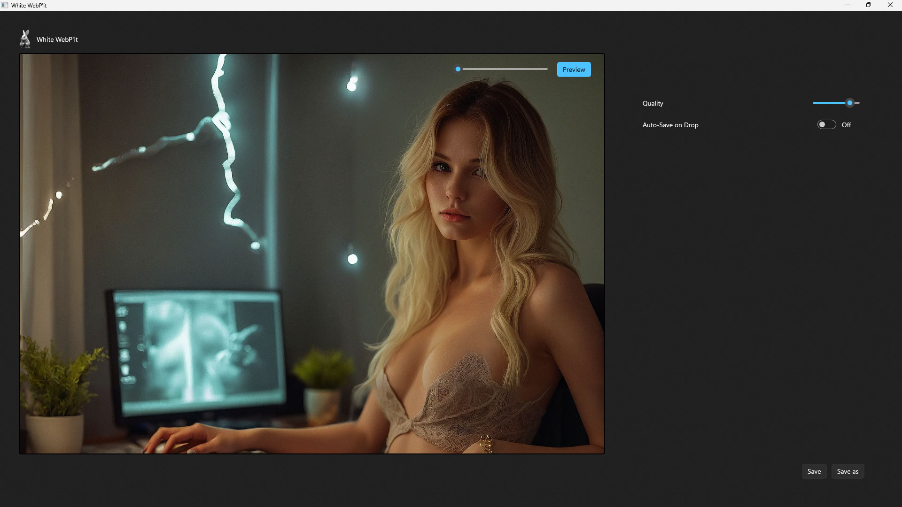
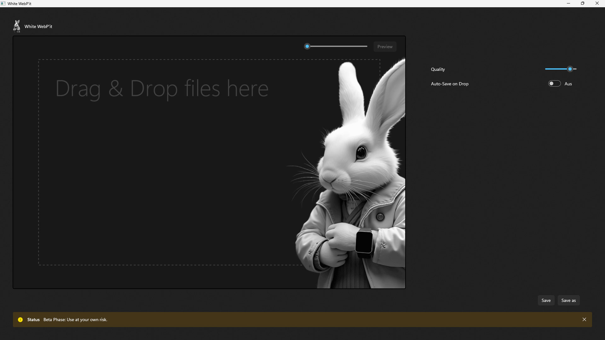

# White WebP'it

A WebP Converter with Preview and Drag & Drop.

> Note: Use the App at your own risk

## Usage

- Drag and Drop Image-Files (`jpg`, `png`, `webp`, `jpeg`)
- Enable Preview using the `Preview`-Button
- Zoom In or Out using the Slider
- Use the `Quality`-Slider to set the WebP Image Quality
- `Auto-Save on Drop` will automatically save an WebP-Image, if it doesn't exist, on Drop
- `Save` to save a WebP using the original Filename with webP Extension (will not overwrite)
- `Save as` using Filepicker to save the File as WebP

## Tasks

- Batch-Conversion
- Filesize Preview
- Solve Preview Issue BitmapData &lt; 17 KB
- Improve Error Handling / User Messages
- Review Full-Trust, other solutions
- ...

---

## Legal Information

- This tool uses Microsoft.WindowsAppSDK, Microsoft.Windows.SDK.BuildTools, Magick.NET-Q8-AnyCPU, Magick.NET.SystemWindowsMedia, ByteSize, etc. Refer to their respective licenses for compliance.
- Ensure your use case complies with data protection regulations, particularly when handling sensitive or personal information.
- The authors provide no warranty and assume no liability for any issues arising from the use of this tool.

---